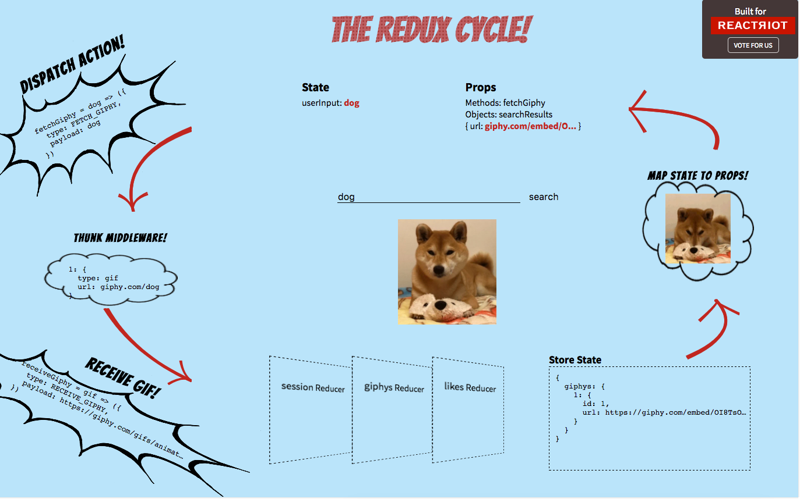
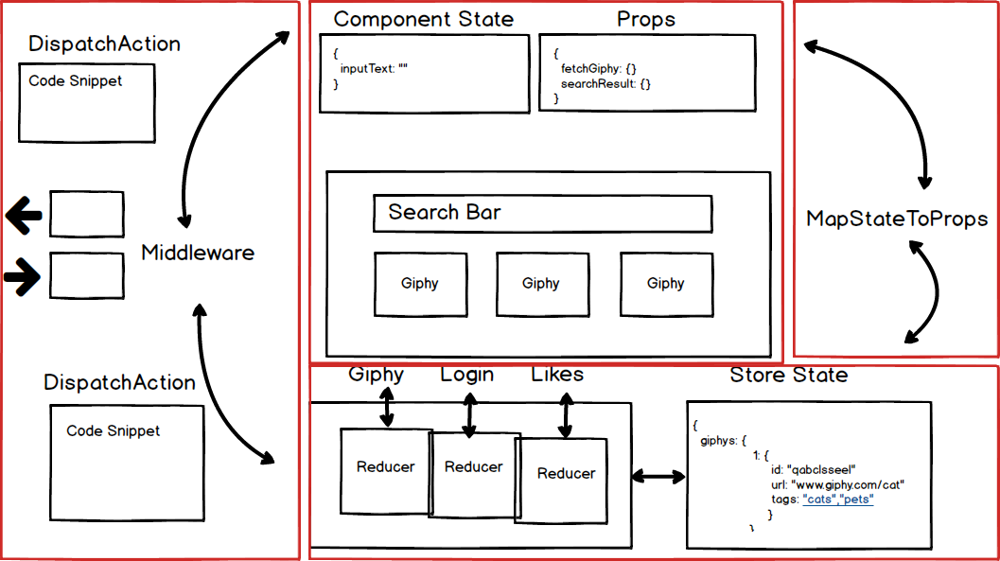

## Redux Visualizer

### Background



Redux Visualizer is a educational tool to help new React/Redux users visualize the flow of the redux cycle when a user interacts with a webpage.

Live Site: [Redux Visualizer](https://hackbit.github.io/reactriot2017-oceanbeach/)

Created by: Audrey Mefford & Bryant Luong & Eric Windmill & Nikita Shalimov

### Technologies

+ React / Redux
+ Webpack / Yarn
+ jQuery / Ajax
+ HTML / CSS / SASS
+ giphy-api


Redux Visualizer is single page application built using **React** for the frontend with a **Redux** architecture to manage data flow. Users interact with the search bar to initiate a request from our React component.

```javascript
submitHandler(e) {
  e.preventDefault();
  this.setState({disabled: true});
  this.props.updateSearchTerm(this.state.userInput);
  if (this.props.currentComponents.length > 0){
    this.props.clearCurrentComponents();
    setTimeout(() => this.props.addCurrentComponent("actions_view"), 750);
  } else {
    this.props.addCurrentComponent("actions_view");
  }
}
```

Once the user hits submit, our view component will send the search term and add the new `CurrentComponent` to store. This sets off chain of `setTimeout` that will start our Redux cycle animation.

```javascript
componentWillReceiveProps(newProps) {
  if (newProps.currentComponents[newProps.currentComponents.length - 1] === 'store') {
    setTimeout(this.setCurrentReducer(0), 200);
    setTimeout(this.setCurrentReducer(1), 1500);
    setTimeout(this.setCurrentReducer(2), 2250);
    setTimeout(
      () => newProps.addCurrentComponent('arrow-to-props'), 3000);
  }
}
```

### Wireframe

